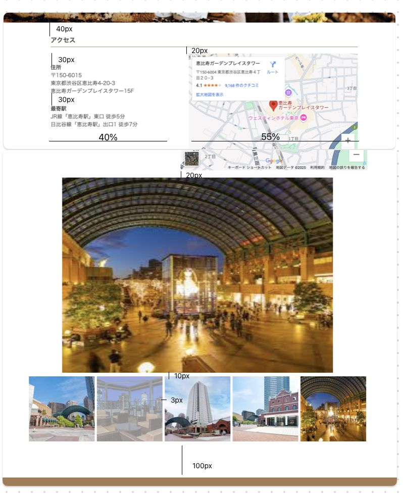

# css_cafe
udemy講座のcss_cafeページのアクセスページを追加する

## 課題
- 開発手順
    1. `clone`を行う
    2. `css_cafe/sample/access.html`を最終目標とする
    3. `css_cafe/asignee/`配下にコードを書いていく
    4. 開発フローの意識のために、コミットをしながら進めるという意識で開発する

## 要件
- `Access`画面に遷移するようにする

- `Access`の画面の追加
    - ナビゲーションバーの配置
    - 住所ページ・地図表示
        - ISTのアクセス画面を参考にして作成する
        - 地図（Google map）を埋め込む
    - 周辺状況の写真を`JavaScript`を用いてスライドショーで表示
        - 5枚の画像を3秒毎で切り替わるようにする
        - スライドショー用の画像の下に5枚の画像を並べて配置する
        - そのうちの画像が押下されたら、その画像からスライドショーがスタートする
            - その場合、押下時から5秒はその画像を表示する
    - footerの配置

- 余白イメージ

